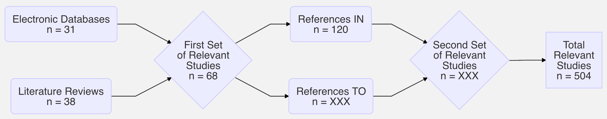

```{r libraries and data, include=FALSE}
library(flexdashboard)
library(knitr)
library(DiagrammeR)
library(tidyverse)
library(googlesheets4)
library(plotly)
library(shiny)

 data <- read_sheet("https://docs.google.com/spreadsheets/d/1IyHoJpZiOV6_0soAgWqEoDCK4Uh9OnvxxaL0aRryN5M/edit#gid=0", sheet = "Data Extraction")
 data <- data %>% drop_na(Source)

# saveRDS(data, "database.Rds")
# data <- readRDS("database.Rds")

data$`Formats / Framing` <- ifelse(str_detect(data$`Topic(s)`, "Formats / Framing"), 1, 0)
data$`Verbal Expressions` <- ifelse(str_detect(data$`Topic(s)`, "Verbal Expressions"), 1, 0)
data$`Visualizations` <- ifelse(str_detect(data$`Topic(s)`, "Visualizations"), 1, 0)
data$`General Understanding` <- ifelse(str_detect(data$`Topic(s)`, "General Understanding"), 1, 0)
data$`Prob. vs. Det.` <- ifelse(str_detect(data$`Topic(s)`, "Prob. vs. Det."), 1, 0)
data$`Opinions / Perceptions` <- ifelse(str_detect(data$`Topic(s)`, "Opinions / Perceptions"), 1, 0)
data$`Small / Long-term risk` <- ifelse(str_detect(data$`Topic(s)`, "Small / Long-term risk"), 1, 0)
data$`Affect / Emotion` <- ifelse(str_detect(data$`Topic(s)`, "Affect / Emotion"), 1, 0)
data$`Other / Misc.` <- ifelse(str_detect(data$`Topic(s)`, "Other / Misc."), 1, 0)

data <- data %>% 
  rename(
    cod_1 = 'Coder',
    cod_2 = 'Coder 2',
    int_1 = 'Int.', 
    int_2 = 'Int. 2', 
    ext_1 = 'Ext.', 
    ext_2 = 'Ext. 2', 
    dom_1 = 'Dom.',
    dom_2 = 'Dom. 2') %>% 
  mutate_at(vars(int_1:dom_2), ~ifelse(. == 0, 1, .)) %>% 
  mutate(int = (int_1 + int_2) / 2, 
         ext = (ext_1 + ext_2) / 2,
         dom = (dom_1 + dom_2) / 2)
```

Executive Summary
=========================================

## Executive Summary

<center> **Living Systematic Review of Research on Communicating Probability Information** </center> 

**Motivation**

Probabilistic forecast information is rapidly proliferating, injecting in a new wave of uncertainty into the forecast and warning process. Most scientists agree that this is a positive development but incorporating probability information into risk communication can be challenging because probabilities are notoriously difficult to communicate effectively to lay audiences. What does the research literature say about the "best" way to include probability information in risk communication? What is the evidence base for different practices? This project endeavors to address these questions by conducting a **living [systematic review](https://en.wikipedia.org/wiki/Systematic_review)** of relevant research from past studies and new studies as they become available.

**Systematic Review**

A systematic review is type of literature review that uses a transparent and replicable methodology to identify relevant research from past studies, evaluate results from those studies, and synthesize findings both qualitatively and quantitatively. Historically systematic reviews have been static; they synthesize the literature at a point in time and become out-of-date almost as soon as they are complete. To prevent this, "[living systematic reviews](https://www.ncbi.nlm.nih.gov/pmc/articles/PMC3928029)" are beginning to replace static reviews. Living reviews follow the same steps but are updated as new research becomes available.

Systematic reviews generally include some combination of the following steps:

1. Define the study domain
2. Search for and identify relevant studies
3. Extract key topics, questions, methods, and findings from relevant studies
4. Evaluate the quality of relevant studies
5. Analyze and combine the studies to identify common topics, questions, methods, and findings
6. Define confidence levels for common findings

This review includes one more step:

7. Assess common findings to develop recommendations to assist in communicating uncertainty and probabilities

**Steps in This Review**

***1. Define the study domain.*** In this review, we focus on research studies that examine the impact of probability information on risk comprehension and protective action decisions/intentions/behaviors. Most of these studies focus on the "best" or most effective way to communicate probability information. For example, are people more likely to take protective action when probability is given verbally or numerically? Though extremely important, the review does not include studies that examine variation in risk or uncertainty perceptions alone. For example, it does not include studies on why some groups percieve high risk from hurricanes whereas others do not.

***2. Search for and identify relevant studies.*** Consistent with best practices, we use three iterative methods to search for and identify relevant studies: (1) electronic search databases; (2) other literature reviews; and (3) citation chains. We use three electronic search databases (ProQuest, Web of Science, and EBSCO Academic Search Elite) to search for studies about probabilistic risk/uncertainty communication in the weather and climate domain that use quantitative methodologies. At the start of this review, these searches resulted in 1,559 potentially relevant studies; 31 met the inclusion criteria---they were original research articles that fit the study domain. Next, we use other reviews of the literature to identify potentially relevant studies. To begin this review, we used 12 other reviews that mentioned 147 potentially relevant studies; 37 met the inclusion criteria for this review. Finally, we use citation chains to identify references IN and references TO relevant studies that we identify in electronic databases and other reviews. For example, we began this review by identifying 68 relevant studies in electronic databases and other reviews. There were 2,312 references In the first set of relevant studies; 120 met the inclusion criteria. There were 3,268 references TO the first set of relevant studies; XXX met the inclusion criteria. In sum, we were able to find XXX unique studies to begin this review. Many of these studies report results from multiple studies. If the studies are sufficiently different (e.g., use a different sample, focus on a different topic), we treat them separately. So, though this review began with XXX complete studies, we actually evaluate and analyze results from **504** distinct studies. Because this is a living systematic review, it is important to note that this is only the beginning of the review. We plan to repeat the steps above every 6 months to make sure that we are including the most up-to-date research.

```{r, fig.align = "center", fig.width = 7, fig.cap = "Fig. 1: Flow Diagram of the Search Relevant Studies"}
# mermaid("
# graph LR
# 1(<center>Electronic Databases<br>n = 31</center>) --> 3{<center>First Set<br>of Relevant<br>Studies<br>n = 68</center>}
# 2(<center>Literature Reviews<br>n = 38</center>) --> 3
# 3 --> 4(<center>References IN<br>n = 120</center>)
# 3 --> 5(<center>References TO<br>n = XXX</center>)
# 4 --> 6{<center>Second Set<br>of Relevant<br>Studies<br>n = XXX</center>}
# 5 --> 6
# 6 --> 7[<center>Total<br>Relevant<br>Studies<br>n = 504</center>]
# ")

```

***3. Extract key topics, questions, methods, and findings from relevant studies.*** We carefully look through each relevant study to extract key topic ares, research questions, research methods, and findings and keep track of these details in a database that is available [here](https://docs.google.com/spreadsheets/d/1IyHoJpZiOV6_0soAgWqEoDCK4Uh9OnvxxaL0aRryN5M/edit#gid=0). The [Bibliographic Archive] tab provides a searchable summary of key information about each study in the review.

***4. Evaluate the quality of relevant studies.*** We use three indicators of validity to assess the quality of each study: (1) external validity (are the results generalizable to the population of interest?); (2) internal validity (are we sure that variation in *x* causes variation in *y*?); and (3) domain validity (how relevant is the study domain to weather hazards and forecasting?). Each dimension is independently given a score by two researchers on a three point scale (1 = low; 2 = medium; 3 = high). We use the mean value of these scores to measure validity along each dimension and overall validity of each study. The [Bibliographic Archive] tab displays the mean scores for each study in the review.

***5. Analyze and combine the studies to identify common topics, questions, methods, and findings.*** We use the database of key topics, questions, methods, and findings from each study to identify common questions, methods, topics, and findings across the relevant studies. Broadly, most of the studies that are currently in the review ask one of two research questions: (1) How does probability information impact risk comprehension? (2) How does probability information impact protective action decisions, intentions, and/or behaviors? A significant majority of the studies use survey research and quantitative analysis (statistics) to address these questions. Many of the studies employ survey experiments to compare the impact of one type of probability information (e.g., a slight chance of rain) to the impact of an alternative way of the present the same information (e.g., a 20% chance of rain). We are able to identify eight common topics that ten or more of the current relevant studies address. For example, the most common topic is *Formats & Framing*. Studies in this topic are address key questions about how to present probabilities --- as percentages, fractions, odds, etc. The [State of the Literature] tab describes all 8 topics and provides information about the proportion of relevant studies that addressed each one. Many studies address multiple topics at once, such as *Formats & Framing* and *Visualizations*. Following topic identification, we identify core findings in each topic area. For example, a core finding in the *Verbal Probability* topic is: *Do not assume that a verbal probability term or statement (such as very likely) will be interpreted the same way by everyone, as there is strong evidence that people interpret such terms much more ambiguously and heterogeneously than most realize. Verbal expressions describing probabilities close to 0%, 50%, and 100% are the least prone to such ambiguity.* In most cases core findings receive support from multiple studies. In a select few instances, core findings may come from a single high quality study. The [Core Findings] tab lists core findings by topic area from the studies that are currently in the the review. These lists will evolve as we update the review with new research.

***6. Define confidence levels for common findings.*** We use three indicators to provide confidence levels on each of the common findings: (1) consistency of evidence (do all studies say the same thing?); quantity of evidence (how many studies are there?); quality of evidence (on average, how much validity do studies have?). Each dimension is given a score on a three point scale (1 = low; 2 = medium; 3 = high). We use the mean value of these scores to assess net confidence in each core finding. The [Core Findings] tab displays these scores for each core finding. These scores are likely to change as we update the review with new research.

***7. Assess common findings to develop recommendations to assist in communicating uncertainty and probabilities.*** This is the most difficult and subjective step in the systematic review. In this step, we work as a team to translate core findings into *actionable* recommendations. This is challenging because we have to decide which of the core findings are certain and relevant enough to support a recommendation. Relevancy is the primary challenge. Many studies in this review advance basic science but do not relate the findings to specific communication challenges. While valuable, it can be difficult to translate these findings into actionable advice for risk communicators. In addition, many studies in the review provide actionable advice on how to communicate probability in domains like healthcare. Again the insight from these studies can be extremely valuable but difficult to translate into actionable advice for risk communicators who work in extreme weather/climate domains. This is where the subjectivity enters into the process. We pick the core findings that we believe are most relevant to risk communicators in extreme weather/climate domains. The [Recommendations] tab displays the core findings that we believe are certain and relevant enough to support tangible recommendations. It also a communication example for each recommendation. While we have extensive experience working with risk communicators in this domain, we cannot know or define everything that might be relevent. We therefore urge risk communicators to carefully examine core findings on their own to see if there might be something of relevance that we are missing in the list of recommendations.

Bibliographic Archive 
=========================================

Column 
-----------------------------------------------------------------------

### Study Name {.no-title .no-padding data-height=20}

<span style="color: #4682B4;"> <font size="3"> **Study:** </span> `r renderText(select_react() %>% pull(var = Study))` </font> 

### Study Details {.no-title data-height=175}

<span style="color: #4682B4;"> **Abstract:** </span> `r renderText(select_react() %>% pull(var = Abstract))`

<span style="color: #4682B4;"> **Internal Validity:** </span> `r renderText(select_react() %>% pull(var = int))`/3 | 
<span style="color: #4682B4;"> **External Validity:** </span> `r renderText(select_react() %>% pull(var = ext))`/3 | 
<span style="color: #4682B4;"> **Domain Validity:** </span> `r renderText(select_react() %>% pull(var = dom))`/3

<span style="color: #4682B4;"> **DOI:** </span> `r renderUI({a(paste(select_react() %>% pull(var = DOI)), href = paste(select_react() %>% pull(var = DOI)))})`

### Bibliographic Archive
```{r}
# Renders the full list of studies. Also acts as the input for the Study Details table above.
font.size <- "10pt"
DT::datatable(data %>% select(Study, 
                              `Summary of Findings`, 
                              `Topic(s)`, 
                              `Internal Validity` = int, 
                              `External Validity` = ext, 
                              `Domain Validity` = dom),
              filter = "none",
              selection = "single",
              rownames = FALSE,
              style = "bootstrap",
              class = "compact",
              options = list(dom = "Blrtip", 
                             initComplete = htmlwidgets::JS("function(settings, json) {", 
                                                            paste0("$(this.api().table().container()).css({'font-size': '", 
                                                                   font.size, "'});"),"}")),
              elementId = 'table1')

# This adds a new variable that indexes the position of each study in the dataset as it appears in the datatable. This is so that we can match the study up to the row number returned by input$table1_row_last_clicked later.

data <- data %>% mutate(tableNumber = c(1:nrow(data)))

# This creates the reactive version of our dataframe, w/ only the columns we want displayed. The if / else statement is there so that the default text is displayed before the user clicks a study on the datatable.

# select_react <- reactive({
# 
#   if(is.null(input$table1_row_last_clicked)){
#     
#     # This is the dataframe that is returned when input$table1_row_last_clicked = NA (on page load, before clicking the table)
#     data.frame(Study = "Click on one of the studies below to learn more!", 
#                Abstract = "None", 
#                DOI = "None", 
#                int = "0", 
#                ext = "0", 
#                dom = "0", 
#                stringsAsFactors = FALSE)
#     
#   } else {
#     
#   data %>%
#       filter(tableNumber == input$table1_row_last_clicked) %>%
#       select(Study, Abstract, DOI, int, ext, dom) %>% 
#       mutate(DOI = paste0("https://doi.org/", DOI))
#       
#   }
# })

select_react <- reactive({

  if(
    
    is.null(input$table1_row_last_clicked)){
    data %>%
      filter(tableNumber == 1) %>%
      select(Study, Abstract, DOI, int, ext, dom) %>%
      mutate(DOI = paste0("https://doi.org/", DOI))

  } else {

  data %>%
      filter(tableNumber == input$table1_row_last_clicked) %>%
      select(Study, Abstract, DOI, int, ext, dom) %>%
      mutate(DOI = paste0("https://doi.org/", DOI))

  }
})
```

State of the Literature {.storyboard}
=========================================

### We are able to identify eight common topics in the literature on risk communication using probability information. *Formats & Framing* is the most frequent topic of study.

```{r}
topic_frequency <- data %>% 
#  filter(`Study ID` == "01") %>%  # this line make the chart reflect only unique papers, not unique studies within those papers.
  select(`Formats / Framing`:`Other / Misc.`) %>% 
  summarise_all(mean) %>% 
  gather(topic, prop)

topic_frequency$topic <- factor(topic_frequency$topic, levels = topic_frequency$topic,
                                labels = c("Formats &\nFraming", "Verbal\nExpressions", "Visualizations", 
                                           "General\nUnderstanding", "Prob. vs. Det.", "Opinions &\nPerceptions", 
                                           "Small &\nLong-term Risks", "Affect &\nEmotion", "Other\nMisc."))

propPlot <- ggplot(topic_frequency, aes(x = topic, 
                                        y = prop, 
                                        fill = prop, 
                                        text = paste0("Topic: ", topic, "<br>", 
                                                      "Proportion of Studies: ", round(prop, 2) * 100, "%"))) +
  geom_bar(stat = "identity") +
  scale_y_continuous(labels = scales::percent, limits = c(0, 0.35)) + 
  labs(y = "Studies (%)", x = "Study Topic") +
  theme_minimal(base_size = 14) +
  theme(axis.text.x = element_text(size = 12)) +
  guides(fill = FALSE) +
  scale_fill_viridis_c()

ggplotly(propPlot, tooltip = c("text"))
```

***

The common topics are:

1. **General Understanding**:
2. **Verbal Expressions**:
3. **Formats / Framing**:
4. **Visualizations**:
5. **Prob. vs. Det**:
6. **Opinions / Perceptions**:
7. **Affect / Emotion**:
8. **Small / Long-term risk**:

### Sentence.

```{r}
# topic plot
```

***

Commentary:

- Text
- Text
- Text

Core Findings
=========================================

Row {.tabset}
-----------------------------------------

### General Understanding

- Text
- Text
- Text

### Verbal Expressions

**Modifier terms (i.e. Not likely, improbable, very likely etc.)**

- **Recommendation**: If combined expressions are used, it remains important to use the correct verbal risk descriptor that is interpreted by people in the same way as the numerical expression that is associated with it. Verbal risk descriptors as a whole mislead rather than inform, leading readers to greatly overestimate their risk of side effects (Webster, Weinman, and Rubin 2017).
 Caution is needed in interpreting the differences in membership functions between the selection and evaluation tasks. Comprehension usually involves a receiver who hears some expression and tries to figure out what it might mean and to what it might refer. Vague probability terms (likely, probable, possible, unlikely, and improbable) can cause difficulty in communication due to interpretation (Fillenbaum et al. 1991, Reyna 1981).
- **Recommendation**: Negative verbal modifiers (i.e. “not likely”, “improbable”, etc.) are interpreted as more qualifying and less definitive than positive verbal modifiers (i.e. “very possible”, “quite likely”, etc.) (Reyna 1981).
- **All studies in this sub-topic**:
    - Fillenbaum et al. (1991)
    - Reyna (1981) Studies 1 and 2 
    - Webster, Weinman, and Rubin (2017)

**Translation Studies**

- Recommendation: Don’t assume that a verbal probability term or statement will be interpreted the same way by everyone, as there is strong evidence that people interpret such terms much more ambiguously and heterogeneously than most realize. Verbal expressions describing probabilities close to 0%, 50%, and 100% are the least prone to such misunderstandings (Amer, Hackenbrack, and Nelson 1994, Beyth-Marom 1982, Brun & Teigen 1988, Budescu et al 2009, Budescu et al 2012, Budescu et al 2014, Christopher et al 2010, Christopher and Hotz 2004, Clark et al 1992, Karelitz & Budescu 2004, Kunneman, Stiggelbout, and Pieterse 2020, Rapoport, Wallsten, and Cox 1987, Reagan et al 1989).
- Recommendation: While interpretations of verbal probability statements vary substantially from person to person, they appear to be largely stable over time for each individual (Budescu and Wallsten 1985, Clarke et al 1992, Karelitz & Budescu 2004, Rapoport, Wallsten, and Cox 1987).
- Recommendation: Peoples’ interpretations of verbal probability statements in the absence of a translation tool tend to regress towards a 50/50 chance (Budescu et al 2009, Budescu et al 2012, Budescu et al 2014, ).
- All studies in this sub-topic:
    - Amer, Hackenbrack, and Nelson (1994)
    - Austin, Hippman, and Honer (2012)
    - Beyth-Marom (1982)
    - Brun & Teigen (1988) Study 1 and 2
    - Budescu and Wallsten (1985)
    - Budescu et al (2009)
    - Budescu et al (2014)
    - Christopher and Hotz (2004)
    - Christopher et al. (2010)
    - Clarke et al. (1992) Studies 1 and 2
    - Hamm (1991) Studies 1 and 2
    - Jaffe-Katz, Budescu, and Wallsten (1989) Study 1
    - Juanchich, Teigen, and Gourdon (2013) Studies 1-5
    - Karelitz & Budescu (2004) Studies 1-3
    - Kunneman, Stiggelbout, and Pieterse (2020)
    - Rapoport, Wallsten, and Cox (1987) 
    - Reagan et al (1989)
    - Taylor, Stevenson, and McDowell (2018)

Reference Points / Directionality
Recommendation: Be mindful of the “reference points” and “directionality” of your verbal probability statements - you could be accidentally implying that your forecasts are higher or lower than “expected” and indirectly influencing how people interpret your communication. Generally, positively directional statements (such as “it is likely that it will rain”) draw attention to the possibility of an event happening and cause people to interpret such statements as more likely, while negatively directional statements (such as “it is unlikely that there will be clear skies”) have the opposite effect. Contextual factors can affect this as well (Honda and Yamagishi 2006; 2009; 2017; McKenzie and Nelson 2003; Teigan and Brun 1999; 2000; 2003, McKenzie and Nelson 2003)
Recommendation: Using positively directional verbal probability statements might be more effective at spurring people to take precautionary actions (Teigen and Brun 1999).
Recommendation: The framing of a verbal probability statement affects how people interpret it as well; independent of the directionality of the phrase, people generally interpret verbal probability statements as more likely when they describe the chance of failure (or an undesirable outcome) as opposed to the chance of success (Juanchich et al 2013, Mandel 2015). 
Recommendation: Different situations can be perceived differently to participants even when using the same wording when using verbal answer scales (very likely, not as likely). To combat this, frequency formats should be used.The presentation and communication of statistical information in the form of frequencies is more intuitive and understandable than alternative forms of presentation such as probabilities and percentages (Krumpal et al.)*Can also be used under modifier terms
All studies in this sub-topic:
Honda, Matsuka, and Ueda (2017)
Honda & Yamagishi (2017) Study 1-4
Honda and Yamagishi (2006) Studies 1 and 2
Honda and Yamagishi (2009)
Juanchich et al. (2013)
Krumpal et. al. (2011)
Mandel (2015)
McKenzie and Nelson (2003) Studies 1 and 2
Teigen and Brun (1999) Studies 1-3
Teigen and Brun (2000) Studies 1-2
Teigen and Brun (2003) Studies 1-3


Context
Recommendation: Purely verbal probability statements regarding politically or socially sensitive issues (Climate Change, for instance) are more prone to being misinterpreted due to motivated reasoning on the part of the listeners due to their ambiguity (Budescu et a l 2012, Piercey 2009)
Recommendation: People often implicitly interpret verbal probability expressions as more likely when they describe more severe or undesirable outcomes (“severity bias”). For instance, someone who interprets a “slight chance” of rain showers to mean a 1-5% chance will likely interpret a “slight chance” of a hurricane to mean something closer to a 10-15% chance (Bonnefon and Villejoubert 2006, Fischer and Jungermann 1996, Harris & Corner 2011, Weber and Hilton 1990).
Recommendation: People often implicitly interpret verbal probability expressions as more likely when they describe events with higher base rates (“base rate bias”). Additionally, interpretations of verbal probability statements will be more homogeneous when they describe events with higher base rates; for instance, all else being equal there will be more agreement about what “it is likely that you will give birth to a child with blond hair” means than what “it is likely that you will give birth to twins” means, since the former is a higher-frequency event than the latter (Pepper and Prytulak 1974, Weber and Hilton 1990).
Recommendation: The contextual effects of base-rate and severity bias are still present even when a precise, numeric version of the forecast is given as well (Windschitl and Weber 1999).
Recommendation: The perceived meaning of verbal probability statements varies depending on the profession and credibility of the communicator (hearing “possible” from a doctor denotes a lower chance than hearing it from a news reporter, for instance), but it appears that these context-dependent effects are largely inconsistent from person to person and thus difficult to predict or characterize in aggregate (Brun & Teigen 1988).
All studies in this sub-topic:
Bonnefon and Villejoubert (2006)
Brun & Teigen (1988) Study 3
Fischer and Jungermann (1996)
Harris & Corner (2011) Studies 1-3
Pepper and Prytulak (1974)
Piercey (2009)
Weber and Hilton (1990) Study 1-3
Windschitl and Weber (1999) Studies 1-3

Vagueness*
Recommendation: When verbally communicating forecasts that are vague or have high uncertainty, be aware that people often implicitly understand more uncertain probabilistic information (i.e. information having a larger confidence interval rather than a smaller one) as signalling a higher likelihood and more severe outcomes, independent of the probabilistic information itself (Løhre 2018, Løhre, Juanchich, et al. 2019).
All studies in this sub-topic:
Kuhn and Budescu (1996)
Løhre (2018) Studies 1 and 6
Løhre, Juanchich, et al. (2019) Studies 1-5


Specific Word Choice - anything about how a specific word / phrase is interpreted or used
Recommendation: When deciding whether to use a word like “can” (which implies a possibility) or “will” (which implies more certainty), be aware of the “extremity effect”: when shown a probability and asked what “can” happen, people tend to focus on the most extreme possible values, and when asked what “will” happen, they tend to focus on the more likely scenarios. If focusing on more remote possibilities would be counterproductive to the goal of your communication, be wary of what your word choice implies about how certain you are and what risks it draws attention to (Teigen and Filkuková 2013, Teigen, Filkuková, and Hohle 2018, Teigen, Juanchich, and Filkukova 2014)
Recommendation: People often use and interpret words like “improbable” to refer to events that aren’t just unlikely (something like a 10-20% chance, for instance), but nearly impossible (closer to a ~1% chance, for instance). Often, “improbable” is implicitly understood to refer to events that have not happened yet, but have a small chance of happening in the future. Clarifying such terms and providing explicit numeric “translations” could help to clear up these kinds of misunderstandings (Teigen, Juanchich, and Riege 2013).
All studies in this sub-topic:
Teigen and Filkuková (2013) Studies 1-5; “will” and “can”
Teigen, Filkuková, and Hohle (2018) Studies 1-5; “will” and “can”
Teigen, Juanchich, and Filkukova (2014) Studies 1-4
Teigen, Juanchich, and Riege (2013)


Verbal versus or in combination with Numerical
Recommendation: In general, it is best to provide an in-text “translation” of verbal statements, preferably right next to the statement in question, in order to anchor the recipients’ interpretation. People do not reliably use guidelines or translation tools unless they are directly in front of them and integrated directly into the communication (Budescu et al. 2009, Budescu et al. 2012, Harris, Por, and Broomell 2017, Wintle et al. 2019).
Recommendation: In scenarios where underestimating risks could have disastrous consequences, it may be better to provide a number first, then use the verbal expression as a translation (opposite to the way the IPCC reports “translate” their uncertainty communications, for example) in order to minimize the “extremity effect” (Jenkins, Harris, and Lark 2018, Jenkins Harris and Lark 2019). 
Recommendation: Purely verbal expressions of risk with no “translation” provided should be avoided. If for some reason you must choose between providing purely verbal or purely numeric information, numeric information should be prioritized because it is interpreted more consistently. There is also some evidence that people tend to be more comfortable with and trusting of purely numeric information as opposed to purely verbal information, and that purely verbal statements often lead people to overestimate risks (Budescu, Weinberg, and Wallsten 1988, Gurmankin et al. 2004, Knapp, Raynor, Woolf et. al. 2009, P. Knapp, Raynor, and Berry 2004).
Recommendation: People generally find verbal probability information more intuitive and easy to use. Numeric probability information, on the other hand, is seen as more precise and elicits more deliberative and reasoned responses (Wallsten et al. 1993, Windschitl and Wells 1996).
All studies in this sub-topic:
Bisantz, Marsiglio, and Munch (2005) Studies 1-4 
Budescu, Teigen and Brun (2012) 
Budescu et al (2012) Studies 1-2
Budescu, Weinberg, and Wallsten (1988)
Erev and Cohen (1990)
Gurmankin et al (2004)
Harris, Por, and Broomell (2017) 
Jenkins, Harris, and Lark (2018)
Jenkins, Harris, and Lark (2019)
Knapp, Raynor, Woolf et. al. (2009)
Knapp, Raynor, and Berry (2004)
Wallsten et al. (1993)
Windschitl and Wells (1996)
Wintle et al. (2019)

### Formats / Framing

- Text
- Text
- Text

### Visualizations

- Text
- Text
- Text

### Prob. vs. Det.

- Text
- Text
- Text

### Opinions / Perceptions

- Text
- Text
- Text

### Affect / Emotion

- Text
- Text
- Text

### Small / Long-term risk

- Text
- Text
- Text

### Other / Misc.

- Text
- Text
- Text

Recommendations {.storyboard}
=========================================

### 1. Use probability information in lieu of deterministic information.

<font size=3.5px>

**Recommendation #1:** Use probability information in lieu of deterministic information.

**Confidence:** High.

**Supporting studies:** Jones 2018; Smith 2020.

**Example:** 

- **Replace**: Watch out! These storms will cause heavy downpours and flooding.
- **With**: Watch out! There is an extremely high (90-95%) chance that these storms will cause heavy downpours and flooding.

</font>

***

Commentary:

- Feature quote:


