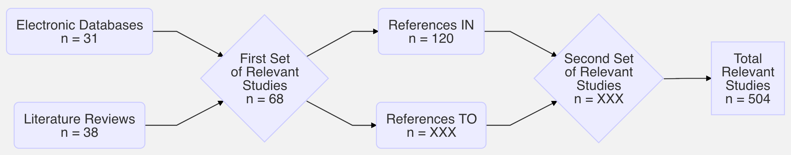

# Living Systematic Review of Research on Communicating Probability Information

**Motivation**

Probabilistic forecast information is rapidly proliferating, injecting in a new wave of uncertainty into the forecast and warning process. Most scientists agree that this is a positive development but incorporating probability information into risk communication can be challenging because probabilities are notoriously difficult to communicate effectively to lay audiences. What does the research literature say about the "best" way to include probability information in risk communication? What is the evidence base for different practices? This project endeavors to address these questions by conducting a **living [systematic review](https://en.wikipedia.org/wiki/Systematic_review)** of relevant research from past studies and new studies as they become available.

**Systematic Review**

A systematic review is type of literature review that uses a transparent and replicable methodology to identify relevant research from past studies, evaluate results from those studies, and synthesize findings both qualitatively and quantitatively. Historically systematic reviews have been static; they synthesize the literature at a point in time and become out-of-date almost as soon as they are complete. To prevent this, "[living systematic reviews](https://www.ncbi.nlm.nih.gov/pmc/articles/PMC3928029)" are beginning to replace static reviews. Living reviews follow the same steps but are updated as new research becomes available.

Systematic reviews generally include some combination of the following steps:

1. Define the study domain
2. Search for and identify relevant studies
3. Extract key topics, questions, methods, and findings from relevant studies
4. Evaluate the quality of relevant studies
5. Analyze and combine the studies to identify common topics, questions, methods, and findings
6. Define confidence levels for common findings

This review includes one more step:

7. Assess common findings to develop recommendations to assist in communicating uncertainty and probabilities

**Steps in This Review**

***1. Define the study domain.*** In this review, we focus on research studies that examine the impact of probability information on risk comprehension and protective action decisions/intentions/behaviors. Most of these studies focus on the "best" or most effective way to communicate probability information. For example, are people more likely to take protective action when probability is given verbally or numerically? Though extremely important, the review does not include studies that examine variation in risk or uncertainty perceptions alone. For example, it does not include studies on why some groups percieve high risk from hurricanes whereas others do not.

***2. Search for and identify relevant studies.*** Consistent with best practices, we use three iterative methods to search for and identify relevant studies: (1) electronic search databases; (2) other literature reviews; and (3) citation chains. We use three electronic search databases (ProQuest, Web of Science, and EBSCO Academic Search Elite) to search for studies about probabilistic risk/uncertainty communication in the weather and climate domain that use quantitative methodologies. At the start of this review, these searches resulted in 1,559 potentially relevant studies; 31 met the inclusion criteria---they were original research articles that fit the study domain. Next, we use other reviews of the literature to identify potentially relevant studies. To begin this review, we used 12 other reviews that mentioned 147 potentially relevant studies; 37 met the inclusion criteria for this review. Finally, we use citation chains to identify references IN and references TO relevant studies that we identify in electronic databases and other reviews. For example, we began this review by identifying 68 relevant studies in electronic databases and other reviews. There were 2,312 references In the first set of relevant studies; 120 met the inclusion criteria. There were 3,268 references TO the first set of relevant studies; XXX met the inclusion criteria. In sum, we were able to find XXX unique studies to begin this review. Many of these studies report results from multiple studies. If the studies are sufficiently different (e.g., use a different sample, focus on a different topic), we treat them separately. So, though this review began with XXX complete studies, we actually evaluate and analyze results from **504** distinct studies. Because this is a living systematic review, it is important to note that this is only the beginning of the review. We plan to repeat the steps above every 6 months to make sure that we are including the most up-to-date research.

```{r, fig.align = "center", fig.width = 7, fig.cap = "Fig. 1: Flow Diagram of the Search Relevant Studies"}
# mermaid("
# graph LR
# 1(<center>Electronic Databases<br>n = 31</center>) --> 3{<center>First Set<br>of Relevant<br>Studies<br>n = 68</center>}
# 2(<center>Literature Reviews<br>n = 38</center>) --> 3
# 3 --> 4(<center>References IN<br>n = 120</center>)
# 3 --> 5(<center>References TO<br>n = XXX</center>)
# 4 --> 6{<center>Second Set<br>of Relevant<br>Studies<br>n = XXX</center>}
# 5 --> 6
# 6 --> 7[<center>Total<br>Relevant<br>Studies<br>n = 504</center>]
# ")

```

***3. Extract key topics, questions, methods, and findings from relevant studies.*** We carefully look through each relevant study to extract key topic ares, research questions, research methods, and findings and keep track of these details in a database that is available [here](https://docs.google.com/spreadsheets/d/1IyHoJpZiOV6_0soAgWqEoDCK4Uh9OnvxxaL0aRryN5M/edit#gid=0). The [Bibliographic Archive] tab provides a searchable summary of key information about each study in the review.

***4. Evaluate the quality of relevant studies.*** We use three indicators of validity to assess the quality of each study: (1) external validity (are the results generalizable to the population of interest?); (2) internal validity (are we sure that variation in *x* causes variation in *y*?); and (3) domain validity (how relevant is the study domain to weather hazards and forecasting?). Each dimension is independently given a score by two researchers on a three point scale (1 = low; 2 = medium; 3 = high). We use the mean value of these scores to measure validity along each dimension and overall validity of each study. The [Bibliographic Archive] tab displays the mean scores for each study in the review.

***5. Analyze and combine the studies to identify common topics, questions, methods, and findings.*** We use the database of key topics, questions, methods, and findings from each study to identify common questions, methods, topics, and findings across the relevant studies. Broadly, most of the studies that are currently in the review ask one of two research questions: (1) How does probability information impact risk comprehension? (2) How does probability information impact protective action decisions, intentions, and/or behaviors? A significant majority of the studies use survey research and quantitative analysis (statistics) to address these questions. Many of the studies employ survey experiments to compare the impact of one type of probability information (e.g., a slight chance of rain) to the impact of an alternative way of the present the same information (e.g., a 20% chance of rain). We are able to identify eight common topics that ten or more of the current relevant studies address. For example, the most common topic is *Formats & Framing*. Studies in this topic are address key questions about how to present probabilities --- as percentages, fractions, odds, etc. The [State of the Literature] tab describes all 8 topics and provides information about the proportion of relevant studies that addressed each one. Many studies address multiple topics at once, such as *Formats & Framing* and *Visualizations*. Following topic identification, we identify core findings in each topic area. For example, a core finding in the *Verbal Probability* topic is: *Do not assume that a verbal probability term or statement (such as very likely) will be interpreted the same way by everyone, as there is strong evidence that people interpret such terms much more ambiguously and heterogeneously than most realize. Verbal expressions describing probabilities close to 0%, 50%, and 100% are the least prone to such ambiguity.* In most cases core findings receive support from multiple studies. In a select few instances, core findings may come from a single high quality study. The [Core Findings] tab lists core findings by topic area from the studies that are currently in the the review. These lists will evolve as we update the review with new research.

***6. Define confidence levels for common findings.*** We use three indicators to provide confidence levels on each of the common findings: (1) consistency of evidence (do all studies say the same thing?); quantity of evidence (how many studies are there?); quality of evidence (on average, how much validity do studies have?). Each dimension is given a score on a three point scale (1 = low; 2 = medium; 3 = high). We use the mean value of these scores to assess net confidence in each core finding. The [Core Findings] tab displays these scores for each core finding. These scores are likely to change as we update the review with new research.

***7. Assess common findings to develop recommendations to assist in communicating uncertainty and probabilities.*** This is the most difficult and subjective step in the systematic review. In this step, we work as a team to translate core findings into *actionable* recommendations. This is challenging because we have to decide which of the core findings are certain and relevant enough to support a recommendation. Relevancy is the primary challenge. Many studies in this review advance basic science but do not relate the findings to specific communication challenges. While valuable, it can be difficult to translate these findings into actionable advice for risk communicators. In addition, many studies in the review provide actionable advice on how to communicate probability in domains like healthcare. Again the insight from these studies can be extremely valuable but difficult to translate into actionable advice for risk communicators who work in extreme weather/climate domains. This is where the subjectivity enters into the process. We pick the core findings that we believe are most relevant to risk communicators in extreme weather/climate domains. The [Recommendations] tab displays the core findings that we believe are certain and relevant enough to support tangible recommendations. It also a communication example for each recommendation. While we have extensive experience working with risk communicators in this domain, we cannot know or define everything that might be relevent. We therefore urge risk communicators to carefully examine core findings on their own to see if there might be something of relevance that we are missing in the list of recommendations.
